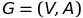

# Grafos

Um grafo nada mais é que uma forma de resolver problemas computacionais com maior efetividade.

Qual séria a melhor rota para minha casa?

Duas pessoas tem um amigo em comum?

## Definição

Um grafo é sempre definido com conjuto de vertices e arestas que conectam estes vertices.

